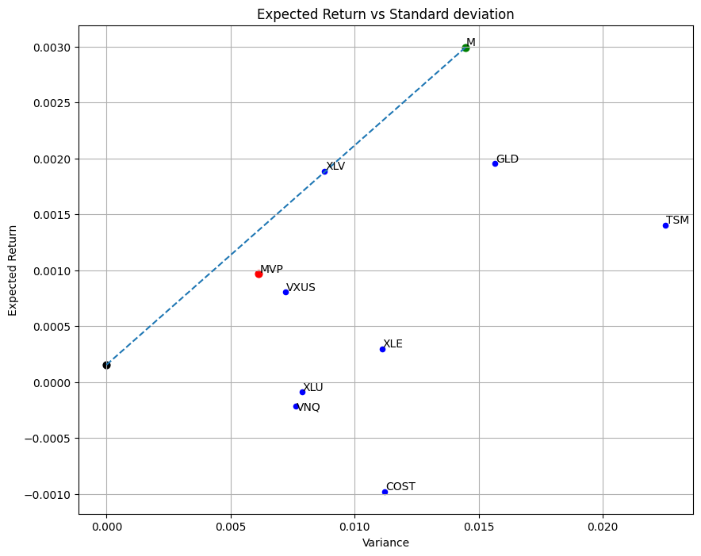

# Minimum Variance Portfolio

This project analyzes a diversified asset universe and constructs a minimum variance portfolio and a market portfolio using historical daily returns.

## Assets
COST, GLD, TSM, VNQ, VXUS, XLE, XLU, XLV

## Methods
- Daily return, expected return and variance calculation
- Covariance matrix calculation
- Minimum variance portfolio
- Market portfolio
- Backtest 3-month performance

